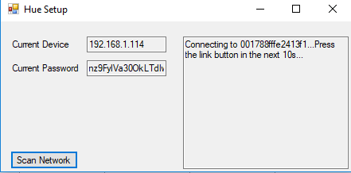
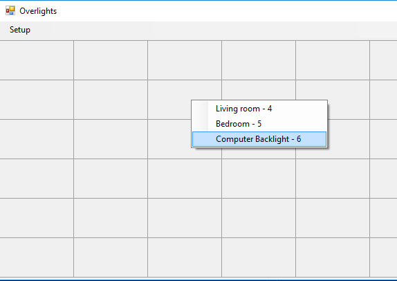

## How to set things up (detailed)

+ Download [the latest build](https://github.com/bengreenier/overlights/releases/latest) and extract the `.zip`

+ Determine where your overwatch installation lives

+ Copy `RzChromaSDK.dll` and `RzChromaSDK64.dll` to the overwatch directory

+ Run `Overlights.exe`

+ (Optional) Connect to your hue base (`Setup -> Hue -> Scan Network`)

+ (Optional) Map some lights to virtual keys

+ Start `Overwatch`

+ Watch virtual keys light up, and (optionally) mapped lights illuminate
